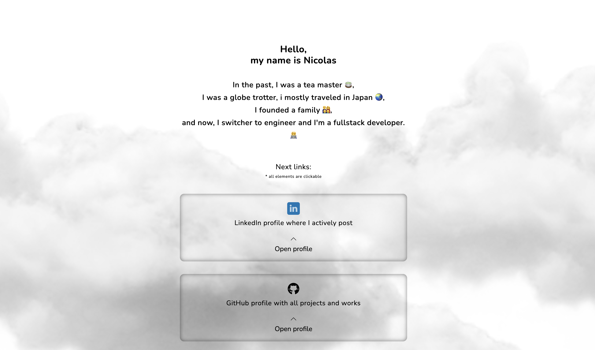
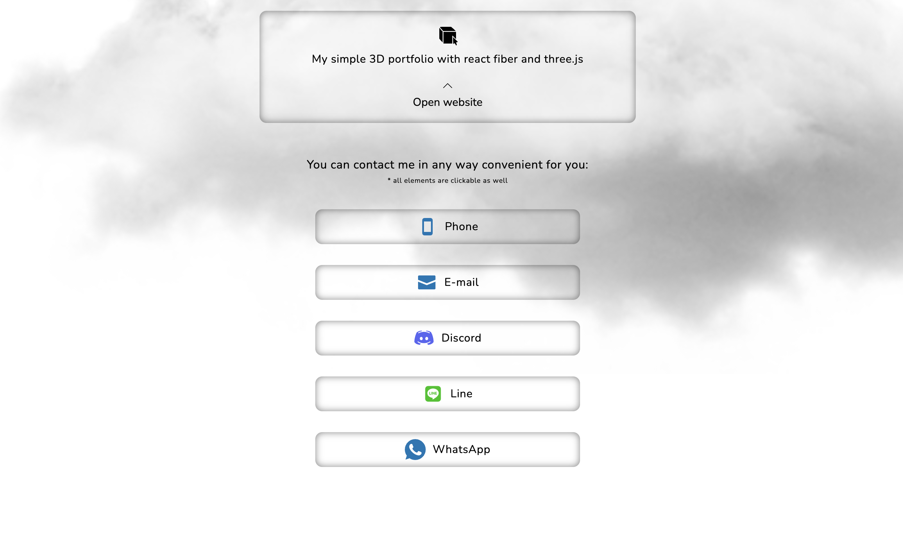

# Link for Instagram header

The purpose of this site is to collect all the necessary links to coordinate people on my accounts in various platforms and social networks

## Table of Contents

- [Project overview](#project-overview)
- [Technologies and libraries used](#technologies-and-libraries-used)
- [Deploy site information (Netlify)](#deploy-site-information-netlify)
- [Screenshots](#screenshots)
- [Getting Started](#getting-started)
  - [Install dependencies](#install-dependencies)
  - [Run the application](#run-the-application)
  - [Application build](#application-build)
  - [Code Linting](#code-linting)
- [Getting Started with Create React App](#getting-started-with-create-react-app)
  - [Available Scripts](#available-scripts)
  - [Learn More](#learn-more)
    - [Code Splitting](#code-splitting)
    - [Analyzing the Bundle Size](#analyzing-the-bundle-size)
    - [Making a Progressive Web App](#making-a-progressive-web-app)
    - [Advanced Configuration](#advanced-configuration)
    - [Deployment](#deployment)
    - [`npm run build` fails to minify](#npm-run-build-fails-to-minify)

## Project overview

With the help of this site, people can easily link to any page that is described on the site.
added a clickable icon, a text description and a button that opens a modal with screenshots of my page (which are also links)

## Technologies and libraries used

The project was implemented using the following technologies and libraries:


## Deploy site information (Netlify)

`Site name` - **cloud-instagram-link**
 Live: [https://cloud-insta-link.netlify.app/](https://cloud-insta-link.netlify.app/) 
`Deploy status badge` - [](https://app.netlify.com/sites/instagram-header-link/deploys)

## Screenshots






## Getting Started

### Install dependencies

The first step is to make sure you have all the dependencies installed. Open a terminal in the root folder of your project and run the command:

```bash
npm install
# or
yarn init
```

This will install all dependencies listed in your package.json.

### Run the application

You can run your application in development mode with the command:

```bash
npm start
# or
yarn yarn-start
```

This command uses the "start" script defined in your package.json to start the local development server. After executing this command, your application will be available at http://localhost:3000 in your browser.

### Application build

If you want to create an optimized build of your application for deployment on the server, run the command:

```bash
npm run build
# or
yarn yarn-build
```

This command will create optimized files in the build folder which you can upload to your hosting.

### Code Linting

If you want to lint your JavaScript code, use the command:

```bash
npm run lint:js
# or
yarn yarn-lint:js
```

This command uses ESLint to find and fix potential problems in your code.

## Getting Started with Create React App

This project was bootstrapped with [Create React App](https://github.com/facebook/create-react-app).

### Available Scripts

In the project directory, you can run:

#### `npm start`

Runs the app in the development mode.\
Open [http://localhost:3000](http://localhost:3000) to view it in your browser.

The page will reload when you make changes.\
You may also see any lint errors in the console.

#### `npm test`

Launches the test runner in the interactive watch mode.\
See the section about [running tests](https://facebook.github.io/create-react-app/docs/running-tests) for more information.

#### `npm run build`

Builds the app for production to the `build` folder.\
It correctly bundles React in production mode and optimizes the build for the best performance.

The build is minified and the filenames include the hashes.\
Your app is ready to be deployed!

See the section about [deployment](https://facebook.github.io/create-react-app/docs/deployment) for more information.

#### `npm run eject`

**Note: this is a one-way operation. Once you `eject`, you can't go back!**

If you aren't satisfied with the build tool and configuration choices, you can `eject` at any time. This command will remove the single build dependency from your project.

Instead, it will copy all the configuration files and the transitive dependencies (webpack, Babel, ESLint, etc) right into your project so you have full control over them. All of the commands except `eject` will still work, but they will point to the copied scripts so you can tweak them. At this point you're on your own.

You don't have to ever use `eject`. The curated feature set is suitable for small and middle deployments, and you shouldn't feel obligated to use this feature. However we understand that this tool wouldn't be useful if you couldn't customize it when you are ready for it.

### Learn More

You can learn more in the [Create React App documentation](https://facebook.github.io/create-react-app/docs/getting-started).

To learn React, check out the [React documentation](https://reactjs.org/).

#### Code Splitting

This section has moved here: [https://facebook.github.io/create-react-app/docs/code-splitting](https://facebook.github.io/create-react-app/docs/code-splitting)

#### Analyzing the Bundle Size

This section has moved here: [https://facebook.github.io/create-react-app/docs/analyzing-the-bundle-size](https://facebook.github.io/create-react-app/docs/analyzing-the-bundle-size)

#### Making a Progressive Web App

This section has moved here: [https://facebook.github.io/create-react-app/docs/making-a-progressive-web-app](https://facebook.github.io/create-react-app/docs/making-a-progressive-web-app)

#### Advanced Configuration

This section has moved here: [https://facebook.github.io/create-react-app/docs/advanced-configuration](https://facebook.github.io/create-react-app/docs/advanced-configuration)

#### Deployment

This section has moved here: [https://facebook.github.io/create-react-app/docs/deployment](https://facebook.github.io/create-react-app/docs/deployment)

#### `npm run build` fails to minify

This section has moved here: [https://facebook.github.io/create-react-app/docs/troubleshooting#npm-run-build-fails-to-minify](https://facebook.github.io/create-react-app/docs/troubleshooting#npm-run-build-fails-to-minify)
# instagram-link
